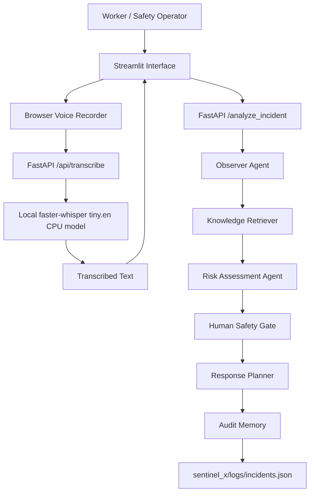

# Sentinel-X 

Sentinel-X is a human-in-the-loop industrial hazardous material emergency decision-support MVP. It supports typed incident reports and offline voice input for workers who cannot easily type while wearing protective gear.

The runtime remains offline-first: no OpenAI API, no external model APIs, no LangChain, no embeddings, and no vector database. Speech-to-Text is used only as a preprocessing step. The original deterministic safety pipeline remains the source of analysis and recommendations.

## Problem Statement

Industrial hazardous material incidents often begin with incomplete field reports. Workers may be wearing Hazmat suits, respirators, gloves, or other protective equipment that makes typing slow or impossible. Sentinel-X helps convert field observations into structured safety recommendations while keeping all critical decisions under human control.

Sentinel-X does not control equipment, replace incident command, or authorize dangerous operations. It provides recommendation-only guidance and records every analyzed incident for audit review.

## Architecture Diagram



## Installation

Requirements:

- Python 3.11 or newer
- `pip`
- Local faster-whisper `tiny.en` model files

Install dependencies:

```powershell
pip install -r sentinel_x/requirements.txt
```

## Offline STT Model Setup

The application does not download STT models at runtime.

By default, Sentinel-X looks for the local model here:

```text
sentinel_x/models/faster-whisper-tiny.en/
```

For a reproducible GitHub ZIP, copy the contents of the downloaded faster-whisper `tiny.en` snapshot into that directory before creating the ZIP or release package. The folder should contain the actual model files, not a nested `snapshots/...` directory.

Expected layout:

```text
sentinel_x/
  models/
    faster-whisper-tiny.en/
      config.json
      model.bin
      tokenizer.json
      vocabulary.*
```

If you keep the model outside the repository, set an environment variable before running the backend:

```powershell
$env:SENTINEL_X_STT_MODEL_PATH = "D:\path\to\faster-whisper-tiny.en"
```

This is useful when model files are too large for normal GitHub commits. The code remains offline in both modes.

## Running Instructions

Run the FastAPI backend:

```powershell
uvicorn sentinel_x.main:app --reload
```

Open:

- API docs: `http://127.0.0.1:8000/docs`
- Health check: `http://127.0.0.1:8000/health`
- STT endpoint: `POST http://127.0.0.1:8000/api/transcribe`

Run the Streamlit demo in a second terminal:

```powershell
streamlit run sentinel_x/streamlit_app.py
```

Use the demo:

1. Select a scenario.
2. Optionally record a voice note.
3. Click `Transcribe voice to incident description`.
4. Review or edit the transcribed text.
5. Click `Analyze`.

Voice transcription does not automatically run safety analysis. A human user still reviews the text and manually starts analysis.

## Demo Scenarios

- UN1090 leaking container: detects acetone by UN code and retrieves the specific SOP.
- Flame symbol on unknown container: retrieves Class 3 flammable guidance by hazard symbol.
- Possible corrosive spill: retrieves Class 8 corrosive guidance by hazard symbol.
- Evidence conflict: detects a conflict when text claims water but hazardous label evidence is present.
- Unknown odor: treats uncertain odor and unknown container evidence conservatively.
- Voice input: records speech in Streamlit, transcribes it offline through `/api/transcribe`, and fills the incident description box.

## Safety Principles

- Runtime does not call OpenAI APIs or external model APIs.
- STT is preprocessing only; it does not make safety decisions.
- Users must review or edit transcribed text before clicking Analyze.
- Recommendations are deterministic and template-based after text enters the Sentinel-X pipeline.
- Unknown hazards use the most conservative fallback.
- Confidence below `0.85` requires human confirmation.
- Critical actions require human approval.
- Sentinel-X never authorizes equipment shutdown, valve operation, physical intervention, or chemical handling.
- No real equipment control is implemented.
- Every analyzed incident is written to `sentinel_x/logs/incidents.json`.

## Testing

Run all tests:

```powershell
python -m pytest tests --basetemp .pytest_tmp
```

Optional compile check:

```powershell
python -m compileall sentinel_x tests
```

Offline STT smoke test:

```text
Generate a local WAV file.
POST /api/transcribe should return HTTP 200 when the local model path is configured.
```

## Future Roadmap

- Add audio quality warnings for noisy industrial environments.
- Add transcript confidence display if exposed by the selected STT engine.
- Expand the JSON knowledge base with more UN codes and hazard classes.
- Add richer site-specific SOP sources and approval workflows.
- Add exportable audit reports for post-incident review.

## Project Structure

```text
sentinel_x/
  main.py
  streamlit_app.py
  requirements.txt
  agents/
  core/
  retrieval/
  knowledge/
  logs/
  models/
    faster-whisper-tiny.en/
  tools/
tests/
  test_pipeline.py
```
