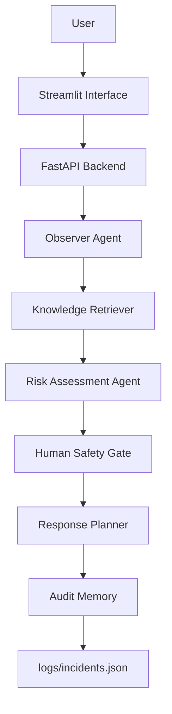

# Sentinel-X

Sentinel-X is a human-in-the-loop industrial hazardous material emergency decision-support MVP. It analyzes incident text, retrieves deterministic SOP knowledge, assesses risk, applies a human safety gate, generates a response plan, and writes an audit record.

The runtime is intentionally simple and offline-first: no OpenAI API, no external model APIs, no LangChain, no embeddings, and no vector database.

## Problem Statement

Industrial teams may need fast, consistent first-pass guidance during hazardous material incidents, especially when reports are incomplete or conflicting. Sentinel-X helps operators convert observations such as UN codes, hazard symbols, odors, and unknown containers into conservative safety recommendations while keeping critical decisions under human control.

Sentinel-X does not control equipment or replace incident command. It provides structured recommendations and records the decision trail for review.

## Architecture Diagram



## Installation

Requirements:

- Python 3.11 or newer
- `pip`

Install dependencies:

```powershell
pip install -r sentinel_x/requirements.txt
```

No additional services or external API keys are required.

## Running Instructions

Run the FastAPI backend:

```powershell
uvicorn sentinel_x.main:app --reload
```

Open:

- API docs: `http://127.0.0.1:8000/docs`
- Health check: `http://127.0.0.1:8000/health`

Run the Streamlit demo:

```powershell
streamlit run sentinel_x/streamlit_app.py
```

Run tests:

```powershell
python -m pytest tests/test_pipeline.py
python -m unittest tests.test_audit_memory tests.test_response_planner tests.test_risk_policy tests.test_observer tests.test_retriever tests.test_knowledge_files
```

## Demo Scenarios

- UN1090 leaking container: detects acetone by UN code and retrieves the specific SOP.
- Flame symbol on unknown container: retrieves Class 3 flammable guidance by hazard symbol.
- Possible corrosive spill: retrieves Class 8 corrosive guidance by hazard symbol.
- Evidence conflict: detects a conflict when text claims water but hazardous label evidence is present.
- Unknown odor: treats uncertain odor and unknown container evidence conservatively.

## Safety Principles

- Runtime does not call OpenAI APIs or external model APIs.
- Recommendations are deterministic and template-based.
- Unknown hazards use the most conservative fallback.
- Confidence below `0.85` requires human confirmation.
- Critical actions require human approval.
- Sentinel-X never authorizes equipment shutdown, valve operation, physical intervention, or chemical handling.
- No real equipment control is implemented.
- Every analyzed incident is written to `sentinel_x/logs/incidents.json`.

## Future Roadmap

- Expand the JSON knowledge base with more UN codes and hazard classes.
- Add richer site-specific SOP sources and approval workflows.
- Add role-based review states for safety officers and incident commanders.
- Add exportable audit reports for post-incident review.
- Improve demo data and UI polish while preserving deterministic runtime behavior.

## Project Structure

```text
sentinel_x/
  main.py
  streamlit_app.py
  requirements.txt
  agents/
  core/
  retrieval/
  knowledge/
  logs/
  tools/
tests/
  test_pipeline.py
```
